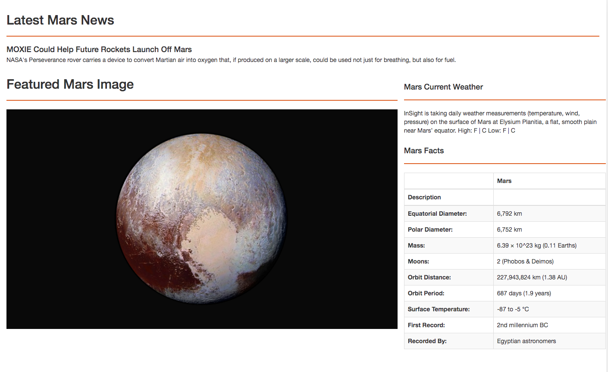
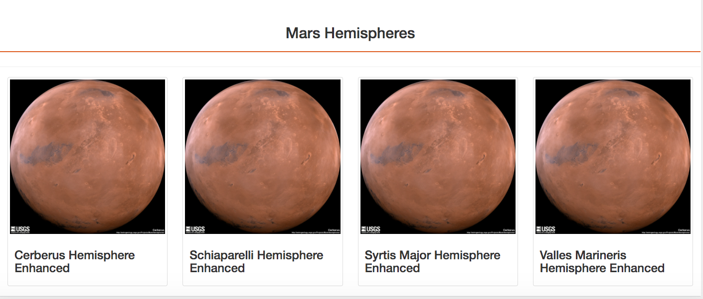

# Scraped of Mars Facts and Images From Multiple Websites

## Overview of Project
The purpose of this project is as follows:
* To automate a web browser to visit different websites to extract data about the Mission to Mars.
* To store the data in a NoSQL database (MongoDB), and then render the data in a web application created with Flask.

## Resources and Tools to Run the Project
1. Install splinter to import Browser
2. Install bs4 to import BeautifulSoup 
3. Import pandas
4. Import datetime
5. Download chromedriver.exe in the path "/usr/local/bin/chromedriver" for Mac Users
6. Run mongoDB: brew services start mongodb-community@4.4 for Mac Users
7. To stop mongoDB:  brew services stop mongodb-community@4.4 for Mac Users
8. Run app.py
9. Open browser with localhost:5000

## Sample of Completed Website

## Scrape URLs
* [Mars News From NASA]( https://mars.nasa.gov/news/ "Text")
* [Feature Image JPL Nasa]( https://www.jpl.nasa.gov/spaceimages/?search=&category=Mars "Feature-Image")
* [Mars Facts From Space Facts]( http://space-facts.com/mars/ "Table")
* [Mars Weathers From NASA]( https://mars.nasa.gov/insight/weather/ "Text")
* [Mars Hemisphere]( https://astrogeology.usgs.gov/search/results?q=hemisphere+enhanced&k1=target&v1=Mars "Images")

## File Information
# Mission-to-Mars\
* app.py: Python file that uses Flask to run URL (localhost:5000), calls template\index.html and updates Mongo DB with new data
* Mission_to_Mars_Challenge.ipynb and Mission_to_Mars.ipynb contains Jupyter Notebook files
* scraping.py: Python file that scrapes new data
* templates\index.html: contain HTML, CSS and Bootstrap to show the web application

